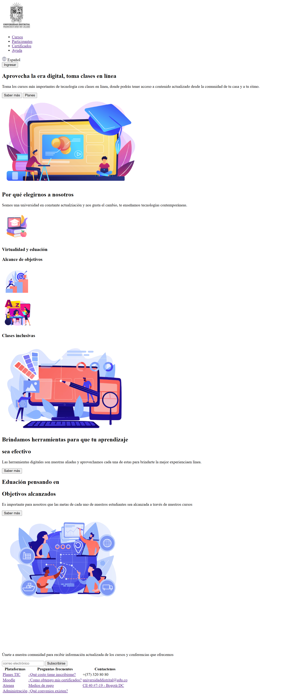
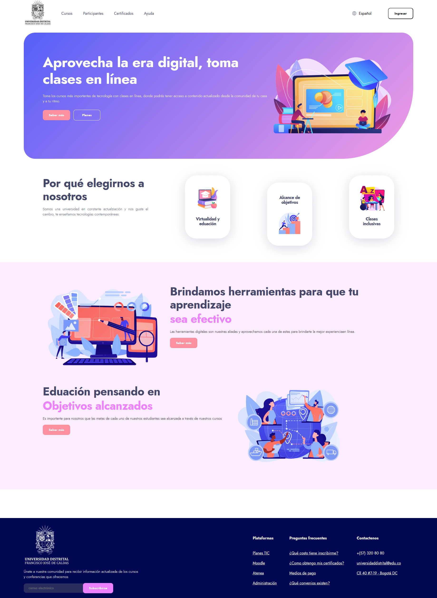
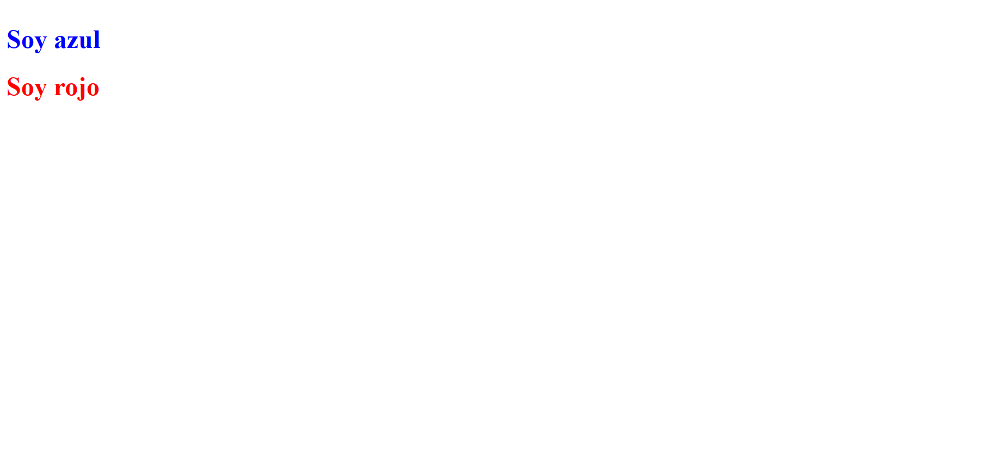
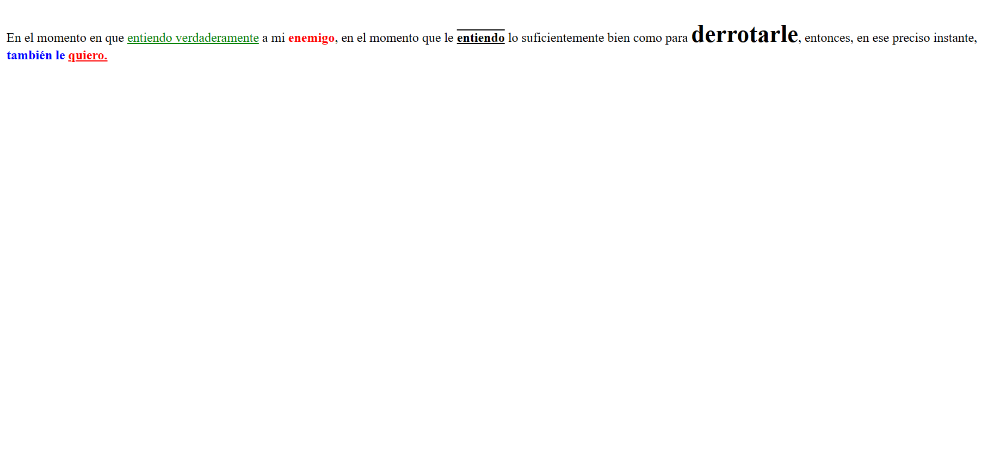
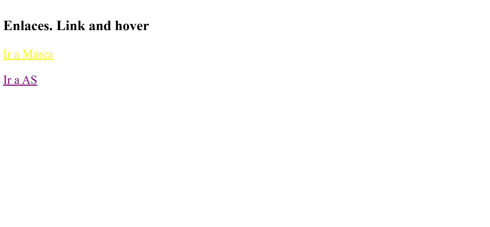
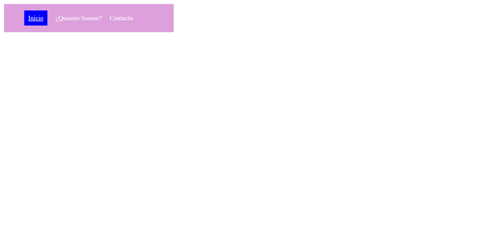

<h1>Taller 9 Angelly Garrido Gallego</h1>

<h2> Información</h2>

Curso: full Stack Basico - Grupo 1

Profesor: Cristian Patiño

<h2> Punto 1: Link figma</h2>
<a href="https://www.figma.com/file/yR4GczimRmo6RArjQhjfJn/Figma-Project-Angelly?type=design&node-id=0%3A1&mode=design&t=lFM1ZAmxqLs8RpL2-1" target="_blank">Link de Figma</a>
<h2>Punto 2: HTML</h2>

<h2>Punto 3: CSS </h2>

<h2>Punto 4: Soy azul, Soy rojo</h2>

<h2>Punto 5: Párrafo</h2>

<h2>Punto 6: Enlaces</h2>

<h2>Punto 7 y 8: Enlaces</h2>
